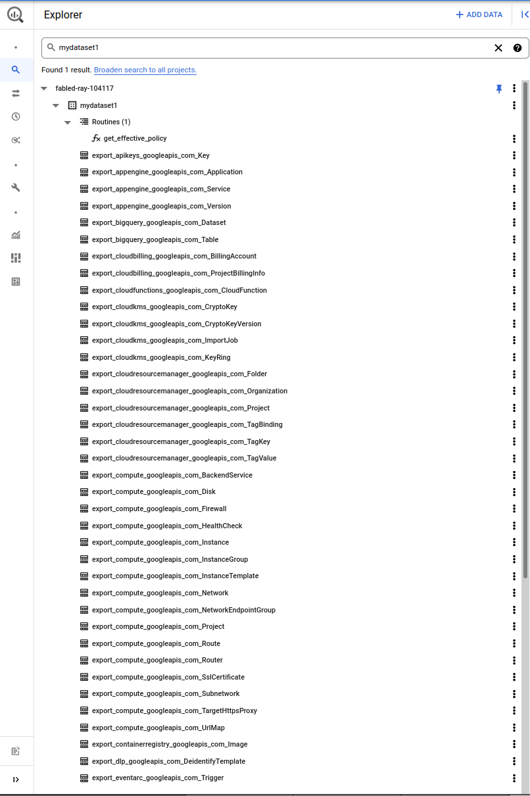

## Auditing Google Cloud Organization Policy 

Google Cloud [Organization Policies](https://cloud.google.com/resource-manager/docs/organization-policy/overview) allows administrators to define what individual projects and resources are capable of doing within the organizations 

For example, suppose you do not want users to create and download [Service Account Keys](https://cloud.google.com/iam/docs/best-practices-for-managing-service-account-keys#alternatives).  An administrator can enforce that easily across the domain by setting the org policy [iam.disableServiceAccountKeyCreation](https://cloud.google.com/resource-manager/docs/organization-policy/restricting-service-accounts#disable_service_account_key_creation).  That will disable the key download capability across the org and down the hierarchy.   For reference, here are some other [usecases](https://cloud.google.com/resource-manager/docs/organization-policy/overview#common_use_cases)

However, sometimes you want to provide exemptions to this policy for low-risk projects or temporary demonstrations.  You can do this in a number of ways like directly applying an exemption policy that overrides the base/root/parent policy or by [setting an organization policy with tags](https://cloud.google.com/resource-manager/docs/organization-policy/tags-organization-policy)


This article describes a mechanism to export organizational policies to BigQuery and determine which projects and folders have a given _effective_ direct or inherited permission exemptions to a policy.   

You can find a list of all the policies [here](https://cloud.google.com/resource-manager/docs/organization-policy/org-policy-constraints) but in this article, we'll use one i enable/disable often:

* **constraints/iam.disableServiceAccountKeyCreation**:  _This boolean constraint disables the creation of service account external keys where this constraint is set to `True`. By default, service account external keys can be created by users based on their Cloud IAM roles and permissions._

Suppose you have the following org structure where the default root policy at the org level is to disable key creation by org policy.

You've then overridden that policy at two places: 

1. In a project immediately below the organization node
2. For a folder immediately below the organization node
   Consequently by default, project below that folder inherits the override.

The structure we'll use is like this 
```
- organization  673208786098  // disable key download on org
    project: fabled-ray-104117  248066739582 // use org default (eg, key download is disabled)
    project: cicp-saml         135456271006  // enable key download on project

    folder: folder1 750467892309             // enable key download on folder
      project: cicp-oidc         343794733782   // inherit enable key download on project
```


So, if you run a query to determine the [getEffectivePolicy](https://pkg.go.dev/cloud.google.com/go/orgpolicy@v1.3.0/apiv2#example-Client.GetEffectivePolicy) at the org node, its enforced where we expect it:

```bash
gcloud org-policies describe iam.disableServiceAccountKeyCreation --organization=673208786098 --effective
        name: organizations/673208786098/policies/iam.disableServiceAccountKeyCreation
        spec:
        rules:
        - enforce: true
```

By default, any project under the org inherits the policy

```bash
$ gcloud org-policies describe iam.disableServiceAccountKeyCreation --project=fabled-ray-104117 --billing-project=fabled-ray-104117 --effective
      name: projects/248066739582/policies/iam.disableServiceAccountKeyCreation
      spec:
        rules:
        - enforce: true
```

but at the other levels described its _not_ enforce:

```bash
gcloud org-policies describe iam.disableServiceAccountKeyCreation --folder=750467892309 --effective
        name: folders/750467892309/policies/iam.disableServiceAccountKeyCreation
        spec:
        rules:
        - enforce: false

gcloud org-policies describe iam.disableServiceAccountKeyCreation --project=cicp-saml --billing-project=fabled-ray-104117 --effective
        name: projects/135456271006/policies/iam.disableServiceAccountKeyCreation
        spec:
        rules:
        - enforce: false


gcloud org-policies describe iam.disableServiceAccountKeyCreation --project=cicp-oidc   --billing-project=fabled-ray-104117  --effective
        name: projects/343794733782/policies/iam.disableServiceAccountKeyCreation
        spec:
        rules:
        - enforce: false
```   


This article is about how you can figure out these overrides for a simple [Boolean Constraint](https://cloud.google.com/resource-manager/docs/organization-policy/using-constraints#boolean-constraint).  You can extend this technique to [List Constraints](https://cloud.google.com/resource-manager/docs/organization-policy/using-constraints#list-constraint) but i'm lazy...i'm going on vacation tomorrow.


>> NOTE, this repo is **NOT** supported by Google. its experimental

### Background

For a bit more background, lets look at the APIs and datastructures we'd usually use

If we query the org node using the [Asset API](https://cloud.google.com/asset-inventory/docs/reference/rest) and filter on the constraints and `orgpolicy.googleapis.com/Policy`, we'll see that the org node has exemptions in place here:

* projectNumber: `135456271006 (cicp-saml)`
* folder:  `750467892309 (folder1)` 
    projectNumber: `343794733782 (cicp-oidc)`


```log
gcloud asset list --organization=673208786098   \
   --asset-types='orgpolicy.googleapis.com/Policy' --content-type='resource'  \
   --format=json | jq '.[] | select(.resource.data.name| endswith("iam.disableServiceAccountKeyCreation")) | select(.resource.data.spec.rules[].enforce==false) | .'

    {
      "ancestors": [
        "folders/750467892309",
        "organizations/673208786098"
      ],
      "assetType": "orgpolicy.googleapis.com/Policy",
      "name": "//orgpolicy.googleapis.com/folders/750467892309/policies/iam.disableServiceAccountKeyCreation",
      "resource": {
        "data": {
          "name": "folders/750467892309/policies/iam.disableServiceAccountKeyCreation",
          "spec": {
            "rules": [
              {
                "enforce": false
              }
            ],
            "updateTime": "2022-06-11T15:13:44.429701Z"
          }
        },
        "discoveryDocumentUri": "https://orgpolicy.googleapis.com/$discovery/rest?version=v2",
        "discoveryName": "Policy",
        "parent": "//cloudresourcemanager.googleapis.com/folders/750467892309",
        "version": "v2"
      },
      "updateTime": "2022-06-11T15:13:44.630371710Z"
    }
    {
      "ancestors": [
        "projects/135456271006",
        "organizations/673208786098"
      ],
      "assetType": "orgpolicy.googleapis.com/Policy",
      "name": "//orgpolicy.googleapis.com/projects/135456271006/policies/iam.disableServiceAccountKeyCreation",
      "resource": {
        "data": {
          "name": "projects/135456271006/policies/iam.disableServiceAccountKeyCreation",
          "spec": {
            "rules": [
              {
                "enforce": false
              }
            ],
            "updateTime": "2022-06-11T16:37:05.437595Z"
          }
        },
        "discoveryDocumentUri": "https://orgpolicy.googleapis.com/$discovery/rest?version=v2",
        "discoveryName": "Policy",
        "parent": "//cloudresourcemanager.googleapis.com/projects/135456271006",
        "version": "v2"
      },
      "updateTime": "2022-06-11T16:37:05.716424569Z"
    }
```

now take the folder `folders/750467892309` and search within it for projects

```bash
## for some reason, the asset list on a folder doesn't work...i think this is a bug
gcloud asset list --folder=750467892309   \
   --asset-types='orgpolicy.googleapis.com/Policy' --content-type='resource'  \
   --format=json | jq '.[] | select(.resource.data.name| endswith("iam.disableServiceAccountKeyCreation")) | select(.resource.data.spec.rules[].enforce==false) | .'

## search-all-resources only returns the policy, not the value enforced... 
# gcloud asset search-all-resources    --scope='organizations/673208786098' \
#        --asset-types="orgpolicy.googleapis.com/Policy" \
#        --query="name:iam.disableServiceAccountKeyCreation"
# gcloud asset search-all-resources    --scope='folders/750467892309' \
#        --asset-types="orgpolicy.googleapis.com/Policy" \
#        --query="name:iam.disableServiceAccountKeyCreation"
#

## so what we'll do is search within the folder 750467892309 for the projects under it
gcloud asset search-all-resources    --scope='folders/750467892309' \
   --asset-types="cloudresourcemanager.googleapis.com/Project" --format=json

    [
      {
        "additionalAttributes": {
          "projectId": "cicp-oidc"
        },
        "assetType": "cloudresourcemanager.googleapis.com/Project",
        "createTime": "2019-11-12T05:50:09Z",
        "displayName": "cicp-oidc",
        "folders": [
          "folders/750467892309"
        ],
        "location": "global",
        "name": "//cloudresourcemanager.googleapis.com/projects/cicp-oidc",
        "organization": "organizations/673208786098",
        "parentAssetType": "cloudresourcemanager.googleapis.com/Folder",
        "parentFullResourceName": "//cloudresourcemanager.googleapis.com/folders/750467892309",
        "project": "projects/343794733782",
        "state": "ACTIVE"
      }
    ]

# and query that project

$ gcloud asset list --project=cicp-oidc --billing-project=fabled-ray-104117      --asset-types='orgpolicy.googleapis.com/Policy' --content-type='resource'     --format=json --format=json
[]
# empty...
```

Its an empty set in this case, `cicp-oidc` gets a policy from its parent folder so there is no binding directly.  This makes it a bit harder to figure out if a specific folder has a policy inherited: you either have to use `getEffectiveOrgPolicy` api or know that the parent node has a policy in effect (eg you know `folder` has a policy)


... the point of this background is that its an iterative approach and adds toil.


### Approach

This article will try to streamline this using the Asset Inventory Export and 

* Export Asset Inventory Data to BQ where each resource type is in its own table




* Query the asset inventory for resources with the policy bound

The specific table we're after is the `orgpolicy.googleapis.com/Policy` resource itself.

That table will include data if the policy is defined 


* Use org policy definition to determine effective policy by merging the hierarchy

Use the [getEffectiveOrgPolicy](https://cloud.google.com/resource-manager/reference/rest/v1/organizations/getEffectiveOrgPolicy) against each resource by calling a [BigQuery Remote Functions in Go](https://blog.salrashid.dev/articles/2022/bq_cloud_function_golang/)

The BQ remote function will accept a list of projects or folder names, then evaluate each for its effective policy and return the rules if its effective or not

---


### Configure BQ Export

The first step is [Exporting Asset Inventory Data to BigQuery](https://cloud.google.com/asset-inventory/docs/exporting-to-bigquery)... i mean, we need this somewhere to query easily


For this we will create a new dataset and export our organization's resources to it in separate tables.  Note we've used `--output-bigquery-force` which will replace all the data everytime its fun

```bash
bq mk mydataset1

## get your org ID
$ gcloud organizations list
DISPLAY_NAME               ID  DIRECTORY_CUSTOMER_ID
esodemoapp2.com  673208786098              C023zw3x8

## specify it in the export
gcloud asset export  --per-asset-type   --content-type resource \
   --partition-key=request-time \
   --organization 673208786098   --bigquery-dataset mydataset1  \
   --bigquery-table export     --output-bigquery-force
```

The following query sill show the policies that are _defined_ at a resource

- Project

```sql
bq  query --use_legacy_sql=false  '
WITH a AS
  (SELECT
  name,
  resource.parent
FROM
  `mydataset1.export_orgpolicy_googleapis_com_Policy`,
  UNNEST(resource.DATA.spec.rules) AS r
WHERE
  ENDS_WITH(name, "iam.disableServiceAccountKeyCreation") = TRUE
  AND r.enforce= FALSE
)
SELECT
  DISTINCT(p.name)
FROM
  `mydataset1.export_cloudresourcemanager_googleapis_com_Project` as p, a
WHERE
  REGEXP_REPLACE(a.parent,"//cloudresourcemanager.googleapis.com/","") IN UNNEST(ancestors)'


+-------------------------------------------------------------+
|                            name                             |
+-------------------------------------------------------------+
| //cloudresourcemanager.googleapis.com/projects/135456271006 |
| //cloudresourcemanager.googleapis.com/projects/343794733782 |
+-------------------------------------------------------------+

```

- Folder

```sql
 bq  query --use_legacy_sql=false  '
WITH a AS
  (SELECT
  name,
  resource.parent
FROM
  `mydataset1.export_orgpolicy_googleapis_com_Policy`,
  UNNEST(resource.DATA.spec.rules) AS r
WHERE
  ENDS_WITH(name, "iam.disableServiceAccountKeyCreation") = TRUE
  AND r.enforce= FALSE
)
SELECT
  DISTINCT(f.name)
FROM
  `mydataset1.export_cloudresourcemanager_googleapis_com_Folder` as f, a
WHERE
  REGEXP_REPLACE(a.parent,"//cloudresourcemanager.googleapis.com/","") IN UNNEST(ancestors)
'

+------------------------------------------------------------+
|                            name                            |
+------------------------------------------------------------+
| //cloudresourcemanager.googleapis.com/folders/750467892309 |
+------------------------------------------------------------+
```

#### Configure BQ External Function

Now configure the [bigquery function](https://cloud.google.com/bigquery/docs/reference/standard-sql/remote-functions).

This function will accept a list of resources and will respond back with (in our case), a conformal map of the policies that re enforced or not.  

for example, if the external function receives

```json
{
    "requestId": "124ab1c",
    "caller": "//bigquery.googleapis.com/projects/myproject/jobs/myproject:US.bquxjob_5b4c112c_17961fafeaf",
    "sessionUser": "test-user@test-company.com",
    "userDefinedContext": {
     "key1": "value1",
     "key2": "v2"
    },
    "calls": [
     ["projects/cicp-oidc/policies/iam.disableServiceAccountKeyCreation"],
     ["projects/cicp-saml/policies/iam.disableServiceAccountKeyCreation"],
     ["projects/fabled-ray-104117/policies/iam.disableServiceAccountKeyCreation"],
     ["folders/750467892309/policies/iam.disableServiceAccountKeyCreation"]      
    ]
}
```

it will respond back with list of policySpecs // https://pkg.go.dev/google.golang.org/genproto/googleapis/cloud/orgpolicy/v2#PolicySpec

```json
{
  "replies": [
    "{\"rules\":[{\"Kind\":{\"Enforce\":false}}]}\n",
    "{\"rules\":[{\"Kind\":{\"Enforce\":false}}]}\n",
    "{\"rules\":[{\"Kind\":{\"Enforce\":true}}]}\n",
    "{\"rules\":[{\"Kind\":{\"Enforce\":false}}]}\n"
  ]
}
```

to set this up

```bash
export GCLOUD_USER=`gcloud config get-value core/account`
export PROJECT_ID=`gcloud config get-value core/project`
export PROJECT_NUMBER=`gcloud projects describe $PROJECT_ID --format='value(projectNumber)'`

# create a conneciton
bq mk --connection --display_name='myconn' --connection_type=CLOUD_RESOURCE \
        --project_id=$PROJECT_ID --location=US my-connection

bq show --location=US --connection  my-connection

# find its service accout
export BQ_CONN_SVC_ACCOUNT=`bq show --format=json --location=US --connection  my-connection  | jq -r '.cloudResource.serviceAccountId'`
echo $BQ_CONN_SVC_ACCOUNT


gcloud organizations list
    DISPLAY_NAME               ID  DIRECTORY_CUSTOMER_ID
    esodemoapp2.com  673208786098              C023zw3x8


gcloud organizations add-iam-policy-binding  673208786098 \
  --member=serviceAccount:$PROJECT_NUMBER-compute@developer.gserviceaccount.com \
  --role=roles/orgpolicy.policyViewer -q

gcloud run deploy get-effective-policy \
   --source . \
   --no-allow-unauthenticated


export CLOUD_RUN_URL=`gcloud run services describe  get-effective-policy --format="value(status.address.url)"`
echo $CLOUD_RUN_URL

gcloud run services add-iam-policy-binding  get-effective-policy \
  --member="user:$GCLOUD_USER" \
  --role="roles/run.invoker"

gcloud run services add-iam-policy-binding  get-effective-policy \
  --member="serviceAccount:$BQ_CONN_SVC_ACCOUNT" \
  --role="roles/run.invoker"

# wait a min until the policies propagate, then test locally
curl -s  -X POST  \
  -H "Authorization: Bearer `gcloud auth print-identity-token`" \
  -H "Content-Type: application/json"  \
  -d @req.json \
  "$CLOUD_RUN_URL" | jq '.'
## to parse the json using jq, use   | jq -r '.replies[]' | jq -r '.rules[].Kind.Enforce'


bq --format=json query --dataset_id=$PROJECT_ID:mydataset1 --location=US --nouse_legacy_sql  "
  CREATE OR REPLACE FUNCTION  get_effective_policy(plaintext STRING) RETURNS STRING 
    REMOTE WITH CONNECTION \`$PROJECT_ID.us.my-connection\`
    OPTIONS (endpoint = '$CLOUD_RUN_URL',  user_defined_context = [('mode', 'org-policy')] );
"
```


For projects

```sql
bq  query --use_legacy_sql=false  '
WITH a AS
  (SELECT
  name,
  resource.parent
FROM
  `mydataset1.export_orgpolicy_googleapis_com_Policy`,
  UNNEST(resource.DATA.spec.rules) AS r
WHERE
  ENDS_WITH(name, "iam.disableServiceAccountKeyCreation") = TRUE
  AND r.enforce= FALSE
)
SELECT
   DISTINCT(p.resource.data.projectId), mydataset1.get_effective_policy(CONCAT("projects/",p.resource.data.projectId, "/policies/iam.disableServiceAccountKeyCreation")) as enforced
FROM
  `mydataset1.export_cloudresourcemanager_googleapis_com_Project` as p, a
WHERE
  REGEXP_REPLACE(a.parent,"//cloudresourcemanager.googleapis.com/","") IN UNNEST(ancestors)'

+--------------+----------------------------------------+
|  projectId   |                enforced                |
+--------------+----------------------------------------+
| cicp-saml    | {"rules":[{"Kind":{"Enforce":false}}]} |
| cicp-oidc    | {"rules":[{"Kind":{"Enforce":false}}]} |
+--------------+----------------------------------------+


```

For folders

```sql
bq  query --use_legacy_sql=false  '
WITH a AS
  (SELECT
  name,
  resource.parent
FROM
  `mydataset1.export_orgpolicy_googleapis_com_Policy`,
  UNNEST(resource.DATA.spec.rules) AS r
WHERE
  ENDS_WITH(name, "iam.disableServiceAccountKeyCreation") = TRUE
  AND r.enforce= FALSE
)
SELECT
   DISTINCT(f.resource.data.name), f.resource.data.displayName, mydataset1.get_effective_policy(CONCAT(f.resource.data.name, "/policies/iam.disableServiceAccountKeyCreation")) as enforced
FROM
  `mydataset1.export_cloudresourcemanager_googleapis_com_Folder` as f, a
WHERE
  REGEXP_REPLACE(a.parent,"//cloudresourcemanager.googleapis.com/","") IN UNNEST(ancestors)'

+----------------------+-------------+----------------------------------------+
|         name         | displayName |                enforced                |
+----------------------+-------------+----------------------------------------+
| folders/750467892309 | folder1     | {"rules":[{"Kind":{"Enforce":false}}]} |
+----------------------+-------------+----------------------------------------+

```

---


### Tags and Conditions

You can also enable an ]org policy based on a Tag that is applied](https://cloud.google.com/resource-manager/docs/organization-policy/tags-organization-policy).  

This is a more indirect way to do things but it also shows up in the export when used with the get effective policy API.

In the following, we will create a tag and bind it to `folder2` and we expect the project under that folder to get the policy inherited.


```bash
- organization  673208786098  // disable key download on org
    folder: folder2 295520844332           // enable key download with Tag Policy
      project: fb-federated 508803172602   // inherit enable key download on project
```

So, first verify that the folder and projects **DO** have the default inherited policy that prevents downloads:


```bash
$ gcloud org-policies describe iam.disableServiceAccountKeyCreation --folder=295520844332 --effective
    name: folders/295520844332/policies/iam.disableServiceAccountKeyCreation
    spec:
      rules:
      - enforce: true

$ gcloud org-policies describe iam.disableServiceAccountKeyCreation --project=fb-federated    --billing-project=fabled-ray-104117  --effective
    name: projects/508803172602/policies/iam.disableServiceAccountKeyCreation
    spec:
      rules:
      - enforce: true
```

Now create and bind the tags

```bash
# create tag key

gcloud resource-manager tags keys create tagdisableServiceAccountKeyCreation --parent=organizations/673208786098

    name: tagKeys/802607794247
    namespacedName: 673208786098/tagdisableServiceAccountKeyCreation
    parent: organizations/673208786098
    shortName: tagdisableServiceAccountKeyCreation

# create a policy
$ cat tag_policy
{
  "name": "folders/295520844332/policies/iam.disableServiceAccountKeyCreation",
  "spec": {
    "rules": [
      {
        "condition": {
          "expression": "resource.matchTag(\"673208786098/tagdisableServiceAccountKeyCreation\", \"yes\")"
        },
        "enforce": false
      },
      {
        "enforce": true
      }
    ]
  }
}


$ gcloud org-policies set-policy tag_policy.json 

    name: folders/295520844332/policies/iam.disableServiceAccountKeyCreation
    spec:
      etag: CIbEl5UGENCd0LwD
      rules:
      - condition:
          expression: resource.matchTag("673208786098/tagdisableServiceAccountKeyCreation",
            "yes")
        enforce: false
      - enforce: true


# list it out
$ gcloud resource-manager tags keys list --parent=organizations/673208786098
    NAME                  SHORT_NAME                           DESCRIPTION
    tagKeys/802607794247  tagdisableServiceAccountKeyCreation


# create a tag value (we're looking for the string "yes" which is what we set it in the condition above)
$ gcloud resource-manager tags values create yes --parent=tagKeys/802607794247 --description="Allow key download"


$ gcloud resource-manager tags values list --parent=tagKeys/802607794247
    NAME                    SHORT_NAME  DESCRIPTION
    tagValues/317867313430  yes         Allow key download

# now finally bind it to the folder
$ gcloud resource-manager tags bindings create \
  --tag-value=tagValues/317867313430 \
  --parent=//cloudresourcemanager.googleapis.com/folders/295520844332
```

In the end, we'll see that its now enforced at the folder and project level

```bash
$ gcloud org-policies describe iam.disableServiceAccountKeyCreation --folder=295520844332 --effective
name: folders/295520844332/policies/iam.disableServiceAccountKeyCreation
spec:
  rules:
  - enforce: false

$ gcloud org-policies describe iam.disableServiceAccountKeyCreation --project=fb-federated    --billing-project=fabled-ray-104117  --effective
name: projects/508803172602/policies/iam.disableServiceAccountKeyCreation
spec:
  rules:
  - enforce: false

```

So a query at the folder and project level yields a new binding match

- Project
```sql
$ bq  query --use_legacy_sql=false  '
WITH a AS
 (SELECT
 name,
 resource.parent
FROM
 `mydataset1.export_orgpolicy_googleapis_com_Policy`,
 UNNEST(resource.DATA.spec.rules) AS r
WHERE
 ENDS_WITH(name, "iam.disableServiceAccountKeyCreation") = TRUE
 AND r.enforce= FALSE
)
SELECT
 DISTINCT(p.resource.data.projectId), mydataset1.get_effective_policy(CONCAT("projects/",p.resource.data.projectId, "/policies/iam.disableServiceAccountKeyCreation")) as enforced
FROM
 `mydataset1.export_cloudresourcemanager_googleapis_com_Project` as p, a
WHERE
 REGEXP_REPLACE(a.parent,"//cloudresourcemanager.googleapis.com/","") IN UNNEST(ancestors)'

+--------------+----------------------------------------+
|  projectId   |                enforced                |
+--------------+----------------------------------------+
| fb-federated | {"rules":[{"Kind":{"Enforce":false}}]} |
| cicp-oidc    | {"rules":[{"Kind":{"Enforce":false}}]} |
| cicp-saml    | {"rules":[{"Kind":{"Enforce":false}}]} |
+--------------+----------------------------------------+


```

- Folder

```sql
$ bq  query --use_legacy_sql=false  '
WITH a AS
  (SELECT
  name,
  resource.parent
FROM
  `mydataset1.export_orgpolicy_googleapis_com_Policy`,
  UNNEST(resource.DATA.spec.rules) AS r
WHERE
  ENDS_WITH(name, "iam.disableServiceAccountKeyCreation") = TRUE
  AND r.enforce= FALSE
)
SELECT
  DISTINCT(f.resource.data.name), mydataset1.get_effective_policy(CONCAT(f.resource.data.name, "/policies/iam.disableServiceAccountKeyCreation")) as enforced
FROM
  `mydataset1.export_cloudresourcemanager_googleapis_com_Folder` as f, a
WHERE
  REGEXP_REPLACE(a.parent,"//cloudresourcemanager.googleapis.com/","") IN UNNEST(ancestors)'
 
+----------------------+----------------------------------------+
|         name         |                enforced                |
+----------------------+----------------------------------------+
| folders/750467892309 | {"rules":[{"Kind":{"Enforce":false}}]} |
| folders/295520844332 | {"rules":[{"Kind":{"Enforce":false}}]} |
+----------------------+----------------------------------------+


```

---

Thats about it...i'll try to refine it ..or if you see any improvements or fixes, please file a git issue ( orpreferably a PR)


---

### Other References

- [Realtime GCP assets and access monitoring using Cloud Asset Monitor and Cloud Log Streaming](https://blog.salrashid.dev/articles/2022/asset_monitor/)
- [BigQuery Remote Functions in Go](https://blog.salrashid.dev/articles/2022/bq_cloud_function_golang/)
- [Using Google Cloud IAM Deny](https://blog.salrashid.dev/articles/2022/iam_deny/)
- [Identifying which IAM Permissions an end-user has on a resource in Google Cloud](https://blog.salrashid.dev/articles/2022/gcp_iam/)

---